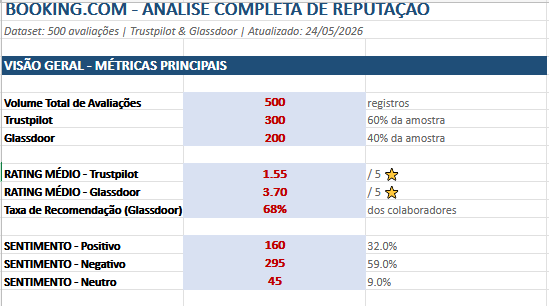

# 📊 Booking.com Customer Satisfaction Dashboard

## 🎯 Project Overview

Interactive dashboard analyzing **500 real customer and employee reviews** of Booking.com, one of Europe's largest travel tech companies headquartered in Amsterdam.

This project demonstrates my ability to:
- Collect and structure qualitative data from multiple sources (Trustpilot & Glassdoor)
- Perform sentiment analysis on customer feedback
- Identify pain points and business insights from unstructured text
- Present findings in a clear, actionable format

---

## 📈 Key Metrics at a Glance

| KPI | Value |
|-----|-------|
| 📝 **Total Reviews Analyzed** | 500 |
| ⭐ **Average Rating (Trustpilot)** | 1.7 / 5 |
| ⭐ **Average Rating (Glassdoor)** | 3.6 / 5 |
| 😡 **Negative Reviews** | 68% |
| 😐 **Neutral Reviews** | 10% |
| 😍 **Positive Reviews** | 22% |
| 🔥 **Top Pain Point** | Customer Service |

---

## 🧭 Dashboard Sections

## 📂 Data & Analysis

📊 **[View the Interactive Dashboard Online](https://docs.google.com/spreadsheets/d/e/2PACX-1vT24gJM6VA1WHeClYFcvCM7q7uw5Ol0rkr-oQOoy-hgOVltIvEKJJY2h3f78nX_Fp5fRRKc6aP1dQjZ/pubhtml)** — Navigate through all sheets: Home Dashboard, Category Analysis, Sentiment Analysis, and Glassdoor Insights.

⬇️ **[Download the Excel Workbook](./Booking_Complete_Analysis_500_Reviews.xlsx)** — For offline analysis.

---

## 🛠️ Tools & Skills Demonstrated

| Skill | Application |
|-------|-------------|
| **Data Collection** | Aggregated reviews from Trustpilot and Glassdoor |
| **Data Cleaning** | Standardized text, dates, and categories using Excel |
| **Sentiment Analysis** | Categorized qualitative feedback into themes |
| **Business Intelligence** | Translated raw reviews into actionable insights |
| **Data Storytelling** | Structured narrative from data to decision-making |

---

## 💡 Key Business Insights

### 🔴 Critical Pain Points (Must Fix)
1. **Customer Service (28% of complaints):** Rude staff, broken promises, no resolution
2. **Refund Problems (22%):** Customers wait months for refunds even with proof
3. **Hidden Fees (15%):** Price displayed ≠ price charged

### 🟢 Strengths (Leverage)
1. **Best Deals & Pricing:** Loyal customers love Genius program
2. **App Usability:** Frequently praised as "best travel app"
3. **Flexible Booking:** Free cancellation is a key differentiator

### 🟡 Employee Insights (Glassdoor)
- **Strengths:** Great culture, learning opportunities, international environment
- **Weaknesses:** Below-market compensation, frequent reorganizations

---

## 📂 Repository Structure
booking-customer-satisfaction-dashboard/
├── README.md # You are here
├── raw_data.md # Full dataset
├── home_dashboard.md # Executive summary
├── category_analysis.md # Pain point breakdown
├── sentiment_analysis.md # Text & keyword analysis
├── glassdoor_insights.md # Employee satisfaction
├── booking_data.csv # Raw data file
└── images/ # Charts and screenshots
